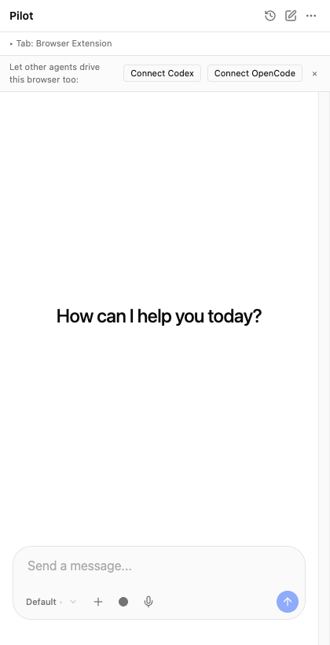
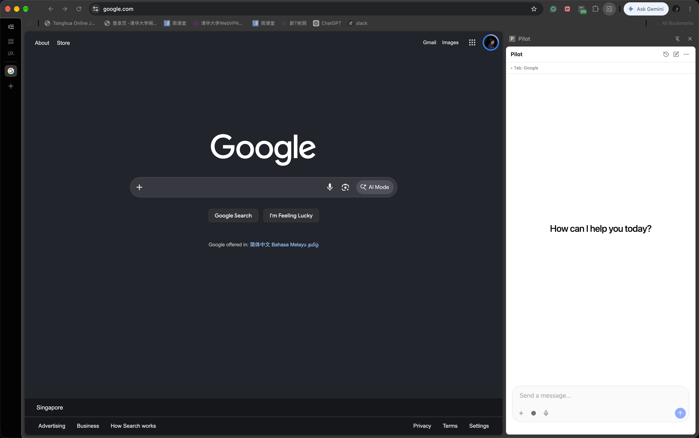

<p align="center">
  
</p>

<h1 align="center">Pilot</h1>

<p align="center">
  A local <b>browser agent</b> for Chrome/Edge — chat with an AI that drives the page you're on,
  record your actions (with voice) into reusable <b>skills</b>, and share the same browser tools
  with other agents (Claude Code, Codex, OpenCode…).
</p>

<p align="center">
  <a href="https://github.com/nigelleong0703/pilot/releases"></a>
  <a href="LICENSE"></a>
  
  
  <a href="https://github.com/nigelleong0703/pilot/stargazers"></a>
</p>

<p align="center"></p>

---

## Install

**1. The extension** — pick one:

- **One command** (downloads + unpacks the latest release):
  ```bash
  curl -fsSL https://raw.githubusercontent.com/nigelleong0703/pilot/main/scripts/install.sh | bash
  ```
  then `chrome://extensions` → **Developer mode → Load unpacked** → `~/.pilot/app/chrome-mv3`.
- **Chrome Web Store** — *coming soon* (needs store review).
- **Manual** — download `pilot-<version>-chrome.zip` from the
  [latest release](https://github.com/nigelleong0703/pilot/releases/latest), unzip, then
  **Load unpacked** the unzipped folder.
- **From source:**
  ```bash
  git clone https://github.com/nigelleong0703/pilot.git && cd pilot
  npm install && npm run build     # -> .output/chrome-mv3 (load this folder)
  ```

**2. The agent bridge (MCP server)** — one command (installs the `pilot-mcp` binary):

```bash
npm install -g @nigelleong0703/pilot-mcp
# or from source:  cd mcp-server && npm install && npm run build
```

**3. Connect your agent** — open the side panel and click **Connect Codex / OpenCode**, or:

```bash
codex    mcp add pilot --env PILOT_EXTENSION_PATH="$HOME/.pilot/app/chrome-mv3" -- pilot-mcp
claude   mcp add pilot --scope user --env PILOT_EXTENSION_PATH="$HOME/.pilot/app/chrome-mv3" -- pilot-mcp
opencode mcp add pilot -- pilot-mcp
```

`PILOT_EXTENSION_PATH` lets the daemon auto-launch a browser with the extension when none is
open. Restart the agent so it loads the MCP server. Verify with `codex mcp list` / `claude mcp list`.

---

```
Claude Code / Codex / OpenCode ──stdio──► MCP server ──ws:9235──► Bridge daemon ──ws:9234──► Extension ──► Page
        (or the Pilot side panel) ──────────acp/*──────────────────┘
```

Three parts:

| Part | What it is |
|---|---|
| **Extension** (`entrypoints/`, `.output/chrome-mv3`) | MV3 extension. Side panel chat, page control, recorder, on-page visuals. |
| **Bridge daemon** (`mcp-server/dist/bridge-daemon.js`) | One long-lived process. Brokers the extension to any number of agents; runs the ACP chat agent; stores skills/transcripts. |
| **MCP server** (`mcp-server/dist/index.js`) | Thin stdio process an agent launches per session. Auto-spawns the daemon; exposes the `browser_*` tools. |

Ports: **9234** daemon↔extension, **9235** daemon↔MCP clients.

---

## Features

- **Chat in the side panel** — an [ACP](https://agentclientprotocol.com) front end. The agent
  drives your current tab and shows reasoning + tool calls as one collapsible
  "thinking" block.
- **Agent picker + bring-your-own-model** — Claude Code, Gemini, Codex, Pi, OpenCode,
  Qwen, Kimi, Grok, or any custom ACP command; optional provider/model/API key.
- **Page perception** — CDP by default (native accessibility tree) with automatic
  DOM fallback; optional viewport screenshots.
- **On-page visuals** — a cursor glides to the element, a glow halo marks it, and the
  whole page gets a "Pilot is controlling this tab" glow frame.
- **Recorder → skill** — record clicks/typing/navigation (each with a cropped
  screenshot), dictate narration (**voice → text**), then Pilot authors a skill and
  exports it to every agent installed on the machine.
- **Deterministic replay** — a saved skill runs in **one call** (`browser_run_skill`),
  no model in the loop.
- **Auto-launch** — if an agent asks for a page action and no browser is connected,
  Pilot starts a browser with the extension for you.
- **History** — past chats with transcript + Continue (resumes with the session's own agent).

---

## Requirements

- Node.js 18+
- Chrome or Edge 109+
- At least one agent CLI on `PATH` (e.g. `codex`, `opencode`) — or the bundled
  Claude adapter with a Claude Code login.

---

## Using Pilot

### Chat (side panel)
Open the side panel and type. The agent drives your current tab through the
`browser_*` tools. Switch agent/model/effort and add an API key in **Settings**.

### Recorder
Click the ● in the composer (or dictate with 🎤, which starts recording too). The
panel switches to a full-screen step list; each step shows a **cropped screenshot of
where you acted**. The bottom bar has:

- **Type a note… / Note** — add a text step instead of speaking
- **🎤** — dictate (voice → text; the first use opens a permission page)
- **Pause / Resume** — stop capturing while you do something off-script
- **■ Stop**

On **Stop**, Pilot authors the skill in the background and shows a **"Save this
skill?"** card (editable name / description / inputs). Saved skills are exported to
Claude Code (`~/.claude/skills`), Codex (`~/.codex/skills`) and Pi (`~/.pi/skills`),
and can be run from the composer **+** menu.

---

## MCP tools

Browser control:

| Tool | Description |
|---|---|
| `browser_list_tabs` | List the tabs in the Pilot group |
| `browser_navigate` | Open a URL in the active (or given) tab |
| `browser_snapshot` | Interactive elements with numbered `ref`s |
| `browser_click` | Click by `ref` or CSS selector |
| `browser_type` | Type into an input (`submit` to press Enter) |
| `browser_select_option` | Choose an option in a `<select>` |
| `browser_get_text` | Visible text of the page |
| `browser_screenshot` | JPEG screenshot of the viewport |

Skills:

| Tool | Description |
|---|---|
| `save_skill` | Persist a skill and auto-export it to every installed agent |
| `list_skills` | List saved skills (`deterministic: true` when it has replay actions) |
| `browser_run_skill` | **Replay a saved skill in one call** (optional `inputs` fill `{{placeholders}}`) |

Recorder: `recorder_start`, `recorder_stop`, `recorder_get_steps`.

Typical loop: `browser_snapshot` → `browser_click` / `browser_type` → repeat, or
`browser_run_skill` for a saved flow.

---

## Packaging & publishing

**Extension (Chrome Web Store).**

```bash
npm run zip            # Chrome -> .output/*-chrome.zip
npm run build:firefox && npm run zip -b firefox   # Firefox (MV3)
```

Upload the Chrome zip in the [Chrome Web Store developer dashboard](https://chrome.google.com/webstore/devconsole).
Expect reviewers to ask about two permissions:

- `debugger` — required for CDP page control (same model Claude in Chrome uses).
- `<all_urls>` — required to act on whatever page you're viewing.

If you don't want CDP, users can switch to **DOM** mode in Settings, but the
`debugger` permission still must be declared.

**MCP server (npm).**

```bash
cd mcp-server
npm pack                # dry-run: inspect the tarball
npm publish             # publishes the `bin` in package.json
```

> When the server is installed outside this repo, the daemon can't infer the
> extension path. Either keep the extension loaded in the browser, or set
> `PILOT_EXTENSION_PATH=/path/to/.output/chrome-mv3` so auto-launch can load it.

---

## Configuration (environment)

| Var | Purpose |
|---|---|
| `MCP_BRIDGE_PORT` / `MCP_BRIDGE_CLIENT_PORT` | Override 9234 / 9235 |
| `PILOT_EXTENSION_PATH` | Extension folder for auto-launch |
| `PILOT_BROWSER_BIN` | Browser executable to launch (auto-detected otherwise) |
| `PILOT_BROWSER_HEADLESS=1` | Launch the auto-started browser headless |
| `PILOT_NO_AUTOLAUNCH=1` | Disable auto-launch entirely |
| `ACP_AGENT_CMD`, `ACP_<AGENT>_CMD` | Override the agent binary |
| `ACP_<AGENT>_ARGS` | Override agent args |

---

## Troubleshooting

- **"Bridge not ready yet" / side panel offline** — the daemon is starting or the
  extension isn't loaded. Reload the extension; wait a few seconds.
- **`browser_*` fails with "extension not connected"** — open a normal web page, or
  let Pilot auto-launch a browser (set `PILOT_BROWSER_BIN` if detection fails).
- **Voice not working** — the first 🎤 click opens a permission page; allow the mic
  there (Chrome suppresses the prompt inside the side panel).
- **Mic keyframes / CSP** — the on-page visuals use only DOM + Web Animations, so they
  work under strict CSP / Trusted Types.
- **Codex/OpenCode can't run a skill** — the `browser_*` tools only exist where the
  Pilot MCP is registered (see *Connect an agent*). Skills exported to those agents
  need that registration.

---

## Screenshots

<p align="center">
  
</p>
<p align="center"><em>The side panel next to the page the agent drives.</em></p>

<p align="center">
  
</p>
<p align="center"><em>The side panel on its own.</em></p>

---

## Development

```bash
npm run dev            # WXT dev server (hot reload)
npm run compile        # tsc --noEmit
npm run build          # production build

cd mcp-server && npm run build
node dist/bridge-daemon.js   # run the daemon manually (logs: ~/.pilot/daemon.log)
```

Data: skills in `~/.pilot/skills`, transcripts in `~/.browser-extension-agent/sessions`,
daemon log in `~/.pilot/daemon.log`.
